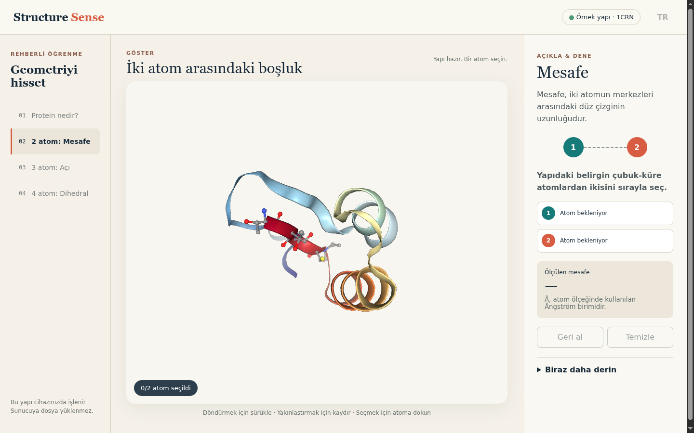

# Structure Sense

Gerçek bir protein yapısı üzerinde atom, mesafe, açı ve torsiyon kavramlarını öğreten, Türkçe ve İngilizce, tamamen tarayıcıda çalışan öğrenme uygulaması.



## Yerel çalışma

```bash
npm install
npm run dev
```

Kalite komutları: `npm run lint`, `npm run typecheck`, `npm test`, `npm run build`.

İlk dikey dilim yerel **1CRN (crambin)** yapısını açar ve iki atom seçerek Å cinsinden mesafe ölçtürür. Koordinatlar [RCSB PDB 1CRN](https://www.rcsb.org/structure/1CRN) kaynağındandır.

## Dil

Arayüz Türkçe ve İngilizce sunulur ve **varsayılan olarak İngilizce** açılır. Başlıktaki dil düğmesi tüm dersi anında çevirir, seçim `localStorage` ile hatırlanır ve sonraki ziyarette geri yüklenir; `<html lang>` de birlikte güncellenir. Tüm arayüz metni `src/i18n/strings.ts` içindeki iki sözlüktedir; her iki sözlük de aynı `Copy` tipini kullandığı için eksik çeviri derleme hatası verir.

## In English

Structure Sense is a browser-only lesson that teaches protein geometry — atoms, distances, angles and torsions — on a real structure. Phase 1 loads a bundled **1CRN (crambin)** structure and measures the distance in Å between two atoms you pick. Nothing is uploaded: the structure is parsed and rendered on your device. Use the header language button to switch between Turkish and English. Run it locally with `npm install && npm run dev`.

## Atıf ve lisans

Görüntüleme için MIT lisanslı NGL 2.4.0 kullanılır. Bilimsel kullanımda Rose ve diğerleri, *Bioinformatics* (2018), bty419 ile Rose ve Hildebrand, *Nucleic Acids Research* (2015), gkv402 çalışmalarına atıf önerilir. Uygulama kodu MIT lisanslıdır; PDB verilerinin kullanımı RCSB PDB kullanım koşullarına tabidir.
